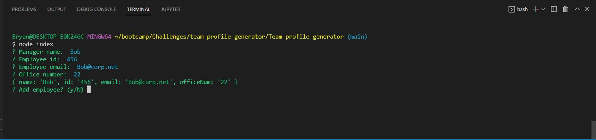
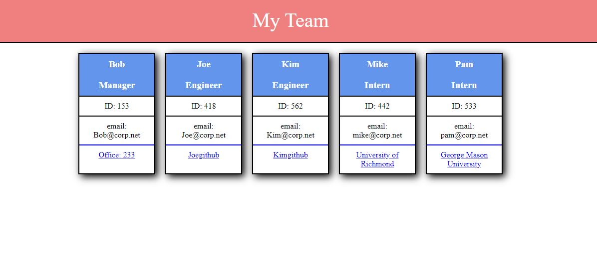

# Team-profile-generator

## Description

Allows user to catalogue employees starting with the manager by entering information via the CLI. Declining to add additional employees will terminate the program and generate an HTML file populate with 'cards' containing the employee information entered.

## Table of Contents

- [Installation](#installation)
- [Usage](#usage)
- [Credits](#credits)
- [License](#license)

## Installation

Requires Node ^16.16.0 and Inquirer ^8.2.4 to run the program. Additionally requires Jest ^24.9.0 for testing.

## Usage

Typing ```node index``` into an integrated bash terminal will start the program which will begin presenting promts in the terminal. Manager information must be entered first, every employee thereafter can be selected by role. Answering 'n' when promted 'Add employee' will terminate the progam and generate the HTML file in the public folder.





link: https://github.com/Bryandalton/Team-profile-generator

Video walkthrough: https://drive.google.com/file/d/1uPheNnYo8Ck6zve9xBcAjJIkXESzMSj1/view

## Credits

Bryan Dalton

bryantdalton19@gmail.com

https://github.com/Bryandalton

## License

N/A
